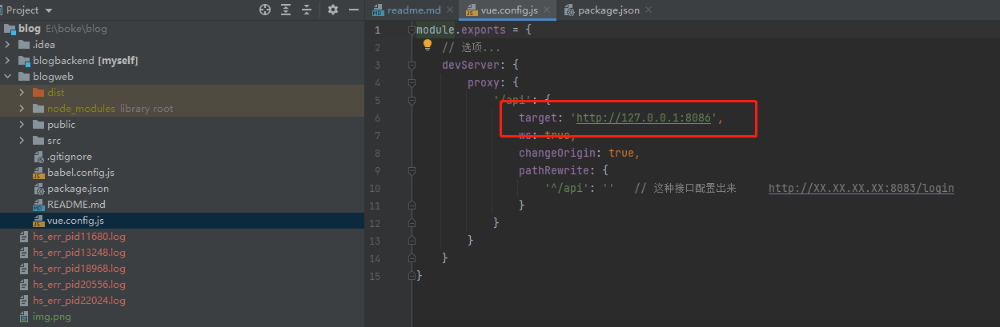

# 开源博客平台
一个基于vue、element ui 的轻量级、前后端分离, 完全开源的博客项目, 适合 **新手入门**

## 前言
SuperSoul-Blog项目致力于为编程新手打造一个完整、易于维护的开源的博客系统，采用现阶段流行技术实现。系统包含博客管理、分类管理、评论管理、认证授权、续写文章、趣味环节（一站到底、古诗词、摇奖）等模块。


此项目会持续优化，欢迎各位同学提出宝贵的意见，有喜欢的可以贡献自己的代码， 让我们一起打造一个更好的学习项目。

## 演示地址

http://www.supersoul.cn/#/


## 项目技术栈
此项目就是为了学习技术, 做实践所用, 所以用了现在比较流行的技术
### 前端 
    Vue + VueRouter + Vuex + ElementUI 
### 后端
    SpringBoot + Mysql + Redis + JPA


## 项目启动

### 前端 

#### 安装依赖
```
    npm install 
```
#### 启动前端项目
```
    npm run serve 启动
```

### 后端
#### 端口
后端我用的8086端口
#### 数据库信息
注意下图中的信息, 更改为自己的
由于使用是JPA, 所以自己只需要创建一个数据库就ok, 第一次启动时 改为create, 自动帮助创建表信息. 完后改为update. 


### 前后端连接
如果更改后端接口, 在下图位置的端口号也需要修改.



## 交流频道

QQ: 1051556543
微信: zjr13453337420
商务合作: 13453337420


